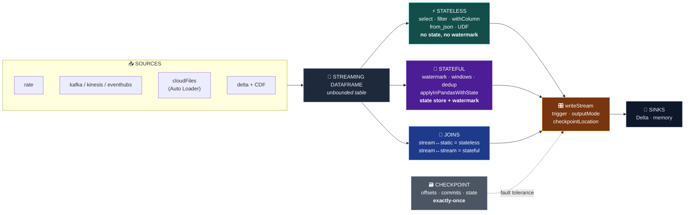

<div align="center">

<br />

# Structured Streaming on Databricks — Every Operation, One Demo

**The full streaming lifecycle in a single runnable notebook: ingestion → stateless → stateful → joins → CDC → output controls. Six stages, ~25 queries, one coherent dataset.**

<br />


<br />

<a href="#-quickstart"><b>Quickstart</b></a> ·
<a href="#-the-mental-model"><b>Mental model</b></a> ·
<a href="#-the-six-stages"><b>Stage map</b></a> ·
<a href="#-walkthrough"><b>Walkthrough</b></a> ·
<a href="#-output-modes--triggers"><b>Modes &amp; triggers</b></a> ·
<a href="#-cheat-sheet"><b>Cheat sheet</b></a> ·
<a href="#-gotchas--production-notes"><b>Gotchas</b></a>

</div>

---

## 💡 Why this exists

Most Structured Streaming material teaches **one** thing at a time: here's a window, here's a watermark, here's a join. What's missing is the connective tissue — how those pieces sit in a single pipeline, and which constraints bite when they meet.

This notebook walks the **entire lifecycle** on one coherent dataset (IoT sensor events, a device dimension, click/purchase streams, a CDC feed), so every stage builds on the last instead of restarting from a toy example.

> **Ideal for:** data engineers moving from batch to streaming, anyone who needs the *whole* API surface in one place, and as a copy-paste reference when you can't remember whether session windows support `update` mode (they don't).

### What you get

| | |
|---|---|
| 📓 **1 notebook, 6 stages** | Ingestion → stateless → stateful → joins → CDC → output controls |
| ⏱️ **`availableNow` everywhere** | Every query processes what's available and stops — deterministic, repeatable, cheap |
| 🪟 **All three window types** | Tumbling, sliding **and** session — with the output-mode constraints called out |
| 🔀 **Both join flavours** | stream↔static (stateless) and stream↔stream (stateful, watermarked on both sides) |
| 🔍 **Real CDC** | Delta Change Data Feed as a stream + `APPLY CHANGES INTO` for pipelines |
| 🎛️ **Every trigger & output mode** | default / `processingTime` / `availableNow` / `once` / `continuous` × `append` / `update` / `complete` |
| 🧠 **Custom state** | `applyInPandasWithState` for when built-in operators aren't enough |
| 📄 **Companion pipeline** | `dlt_cdc_pipeline.py` — the DLT/Lakeflow version of §5 |

---

## 🚀 Quickstart

**1. Import both notebooks**

> Databricks workspace → <kbd>Workspace</kbd> → right-click → <kbd>Import</kbd> → upload `notebooks/streaming_ops_databricks.py` *and* `notebooks/dlt_cdc_pipeline.py`

**2. Attach to any cluster** (single-node is fine — the whole thing is ~9 rows of sensor data)

**3. Run it**

> <kbd>Run All</kbd>

Nearly every query uses **`.trigger(availableNow=True)`** — *"process everything currently available, then stop."* That's what makes a streaming notebook behave like a deterministic test suite: no infinite loops, no waiting, identical results on re-run.

> 🔄 **Re-run the Setup cell (§0) any time to reset everything.**
> ⚠️ **Two cells mutate state on purpose** (§3a's "new data arrives", §3c's duplicate replays) — reset via Setup rather than re-running them in isolation.

### Which cells need Databricks?

| Cell | Requirement |
|---|---|
| §1a rate source, §2, §3, §4, §5a, §6 | Any Spark 3.x with Delta — works locally too |
| §1c **Auto Loader** (`cloudFiles`) | 🟠 **Databricks only** — needs `dbutils` and the `cloudFiles` format |
| §5b `APPLY CHANGES INTO` | 🟠 **Runs in a pipeline**, not a notebook cell — use the companion file |
| §6b continuous trigger | 🟡 Experimental — wrapped in `try/except`, prints a message if unavailable |

<details>
<summary><b>Running outside Databricks</b></summary>

The notebook detects its environment: it uses `/FileStore/stream_demo` on DBFS when `dbutils` exists, and falls back to a local directory otherwise.

```bash
pip install "delta-spark==3.*" pyspark pandas
```

```python
from delta import configure_spark_with_delta_pip
from pyspark.sql import SparkSession

builder = (
    SparkSession.builder
    .appName("streaming-demo")
    .config("spark.sql.extensions", "io.delta.sql.DeltaSparkSessionExtension")
    .config("spark.sql.catalog.spark_catalog", "org.apache.spark.sql.delta.catalog.DeltaCatalog")
)
spark = configure_spark_with_delta_pip(builder).getOrCreate()
```

Paste the cells in order, substituting `display(df)` with `df.show()`. Skip §1c (Auto Loader) and §5b.

</details>

---

## 🧠 The mental model

> **Streaming = an unbounded table that keeps growing.** You transform it almost exactly like a static DataFrame — with a few constraints so processing stays fault-tolerant and **state stays bounded**.



**The one rule that explains every constraint in this notebook:** anything that must *remember* something across micro-batches needs a **state store**, and unbounded state will eventually kill your cluster — so it must be bounded by a **watermark**.

---

## 🗺️ The six stages

| # | Lifecycle stage | Demonstrated in | Stateful? |
|:---:|---|---|:---:|
| **1** | **Ingestion & source config** (`readStream`) | §1 — `rate` source, Auto Loader, Kafka/Kinesis/Event Hubs syntax | — |
| **2** | **Stateless transformations** | §2 — `select` / `filter` / `withColumn` / `from_json` / UDF | ❌ no |
| **3** | **Stateful transformations** | §3 — watermark, tumbling/sliding/session windows, dedup, custom state | ✅ yes |
| **4** | **Stream joining** | §4 — stream↔static (stateless) & stream↔stream (stateful) | mixed |
| **5** | **Change Data Capture** | §5 — Delta CDF stream + `APPLY CHANGES INTO` (DLT) | ✅ yes |
| **6** | **Output controls** (`writeStream`) | §6 — triggers, output modes, checkpointing | — |

### The sample data

| Table | Rows | Role |
|---|:---:|---|
| `events_raw` | 4 → 9 | IoT sensor events. Contains a **faulty reading** (`temp: 99`) and a **broken payload** (`this-is-not-json`) on purpose |
| `devices` | 2 | Static dimension for the stream↔static join |
| `clicks_raw` | 2 | Stream A for the stream↔stream join |
| `purchases_raw` | 2 | Stream B for the stream↔stream join |
| `cdc_src` | 2 | Delta table with **Change Data Feed enabled** |

> The dirty rows aren't decoration — they're what makes §2's filter, §2's `from_json` and §3's late-data handling visibly *do* something.

---

## 🔬 Walkthrough

<details>
<summary><b>§0 — Setup</b></summary>

Creates schema `stream_demo`, the five tables above, and the working paths (`BASE`, `CKPT`). Note `cdc_src` is created with `TBLPROPERTIES (delta.enableChangeDataFeed = true)` — everything in §5 depends on that one property.

</details>

### §1 · Ingestion & source configuration

**1a — the `rate` source.** Generates rows with timestamps; the only source that needs zero infrastructure.

```python
rate_query = (
    spark.readStream.format("rate")
    .option("rowsPerSecond", 5)                  # throttle built into the source
    .load()                                      # -> streaming DataFrame
    .writeStream.format("memory").queryName("rate_live")
    .outputMode("append")
    .trigger(processingTime="1 second")          # micro-batch every second
    .start()
)
time.sleep(3)
rate_query.stop()
```

This is the **only** cell with a `processingTime` trigger and a `sleep` — it exists so you can *watch* a stream grow. ~15 rows after 3 seconds.

**1b — message-bus sources (syntax reference).** Kafka/Kinesis/Event Hubs need a broker, so they aren't run on Community Edition, but the API is the same `readStream` pattern:

```python
kafka = (spark.readStream.format("kafka")
    .option("kafka.bootstrap.servers", "host:9092")
    .option("subscribe", "events_topic")
    .option("startingOffsets", "earliest")       # or "latest", exact offsets, or startingTimestamps
    .load())                                     # columns: key, value(bytes), timestamp, topic, offset...
```

Kafka's `value` is **raw bytes** → parse it in §2 with `from_json()` / `from_avro()`.

**1c — Auto Loader (`cloudFiles`).** 🟠 Databricks only. Incremental file ingestion with schema inference/evolution, a rescued-data column, and rate limiting:

```python
spark.readStream.format("cloudFiles")
    .option("cloudFiles.format", "json")
    .option("cloudFiles.schemaLocation", f"{BASE}/_schemas")   # remembers/evolves the schema
    .option("cloudFiles.schemaEvolutionMode", "addNewColumns") # new columns are ADDED
    .option("cloudFiles.rescuedDataColumn", "_rescued_data")   # bad values parked here
    .option("maxFilesPerTrigger", 1)                           # rate limit: 1 file per micro-batch
    .load(INCOMING)
```

Then **schema drift arrives** — a new column (`humidity`) *and* a bad value (`"hot"` for an int column):

| device | temp | humidity | `_rescued_data` |
|:---|:---|:---:|:---|
| d1 | 21 | *null* | *null* |
| d2 | 19 | *null* | *null* |
| d3 | **null** | 55 | ⚠️ `{"temp":"hot"}` |

The column appeared automatically because of `addNewColumns`; the unparseable value was **parked, not dropped** — so a schema change never silently corrupts a pipeline.

---

### §2 · Stateless transformations

Each record is processed **independently** — no watermark, no state, no restrictions. One chain covers parse → column ops → filter → UDF:

```python
stateless = (
    spark.readStream.format("delta").table("events_raw")
    .withColumn("parsed", F.from_json("payload", "temp INT"))   # JSON payload -> columns
    .withColumn("temp", F.col("parsed.temp"))
    .withColumn("temp_f", F.col("temp").cast("double") * 9 / 5 + 32)
    .withColumn("ingest_time", F.current_timestamp())
    .drop("parsed", "payload")
    .filter(F.col("temp").isNotNull() & (F.col("temp") < 50))   # drops broken JSON + faulty 99
    .select("id", "device", "temp", "temp_f", "ingest_time", "event_time")
)

@F.udf(returnType="string")
def severity(temp):
    return "HIGH" if temp and temp >= 50 else "OK"

stateless = stateless.withColumn("severity", severity("temp"))
```

**2 of 4 events survive:**

| id | device | temp | temp_f | severity |
|:---:|:---|:---:|:---:|:---:|
| 1 | d1 | 21 | 69.8 | OK |
| 3 | d2 | 19 | 66.2 | OK |

💀 `id 2` (`temp: 99`) and `id 4` (`this-is-not-json`) are gone — one by the filter, one by `from_json` returning `null`.

> ⚠️ **Deliberate teaching moment:** `severity` is `OK` for *every* surviving row, because the UDF runs **after** `filter(temp < 50)` — it can never see a `HIGH` value. Order matters. See [Gotchas](#-gotchas--production-notes).

---

### §3 · Stateful transformations

Stateful ops remember data **across micro-batches** in a state store (RocksDB on Databricks), and need a **watermark** to (a) accept late data and (b) bound how long state is kept.

#### 3a · Watermark + tumbling windows + late data — the centerpiece

```python
(spark.readStream.format("delta").table("events_raw")
    .withWatermark("event_time", "1 minute")          # allowed lateness = 60s
    .groupBy(F.window("event_time", "1 minute"))      # tumbling: fixed, non-overlapping
    .count()
    .writeStream.format("delta").outputMode("append")
    .option("checkpointLocation", f"{CKPT}/windows")
    .trigger(availableNow=True)
    .toTable("windows_out"))
```

**Run 1** — max event time is `10:04:00`, so the watermark is `10:03:00`. Append mode only emits a window **once the watermark has passed its end**, so only `[10:00, 10:01)` is emitted:

| window | count |
|:---|:---:|
| `[10:00:00, 10:01:00)` | **3** |

**Then three events arrive:**

| Event | Time | Fate |
|:---|:---:|---|
| `id 5` | `10:03:30` | ⏰ **late but within** the 1-minute watermark → **counted** |
| `id 6` | `10:12:00` | 🚀 far-future event — pushes the watermark to `10:11`, closing windows |
| `id 7` | `10:01:30` | 💀 **too late** (older than the watermark) → **dropped** |

**Run 2** — `windows_out` now reads:

| window | count | Note |
|:---|:---:|---|
| `[10:00:00, 10:01:00)` | 3 | emitted in run 1 |
| `[10:03:00, 10:04:00)` | 1 | ⏰ **the late event was captured** |
| `[10:04:00, 10:05:00)` | 1 | closed once the watermark reached `10:11` |
| ~~`[10:01:00, 10:02:00)`~~ | — | 💀 **never appears** — the too-late event was dropped |

That's the whole watermarking trade-off in one table: **1 minute of tolerance bought `id 5` and cost `id 7`.**

#### 3b · Sliding & session windows

```python
.groupBy(F.window("event_time", "2 minutes", "1 minute"))   # sliding: 2-min window, moves every 1 min
.groupBy("device", F.expr("session_window(event_time, '5 minutes')"))  # session: 5-min idle gap
```

The **7** events expand to **14** sliding rows (each event lands in two overlapping windows):

| window | count |
|:---|:---:|
| `[09:59, 10:01)` | 3 |
| `[10:00, 10:02)` | 4 |
| `[10:01, 10:03)` | 1 |
| `[10:02, 10:04)` | 1 |
| `[10:03, 10:05)` | 2 |
| `[10:04, 10:06)` | 1 |
| `[10:11, 10:13)` | 1 |
| `[10:12, 10:14)` | 1 |

Session windows (grouped by device, `complete` mode):

| device | sessions | events |
|:---|:---:|:---:|
| `d1` | **1** | 5 — all within a 5-minute gap of each other |
| `d2` | **2** | 1 + 1 — split by an **8-minute** idle gap |

> 🚫 **Session windows reject `update` mode**, and streaming has **no global session aggregation** — you must supply a grouping key. That's why the query uses `complete` mode here.

#### 3c · Streaming deduplication

Two events are replayed (duplicates of `id 1` and `id 5`):

```python
(spark.readStream.format("delta").table("events_raw")
    .withWatermark("event_time", "10 minutes")    # dedup state expires with the watermark
    .dropDuplicatesWithinWatermark(["id"])        # keep first occurrence of each id
    ...)
```

```
raw events = 9, after dedup = 7   (duplicates collapsed, state bounded by watermark)
```

Without the watermark this state would grow forever. With it, Spark can forget an `id` once it's provably too old to match anything.

#### 3d · Arbitrary stateful processing

When built-in operators aren't enough — `applyInPandasWithState` (Python; Scala/Java use `mapGroupsWithState` / `flatMapGroupsWithState`):

```python
def running_count(key, rows, state):
    total = state.get[0] if state.exists else 0      # state survives across micro-batches
    for chunk in rows:                               # each item is a pandas DataFrame
        total += len(chunk)
        state.update((total,))                       # state schema is a struct -> pass a tuple
    yield pd.DataFrame([(key[0], total)], columns=["device", "running_count"])

(... .groupBy("device").applyInPandasWithState(
        running_count,
        outputStructType="device STRING, running_count LONG",
        stateStructType="total LONG",
        outputMode="update",
        timeoutConf="NoTimeout",                     # or ProcessingTimeTimeout / EventTimeTimeout
    ) ...)
```

| device | running_count |
|:---|:---:|
| d1 | 7 |
| d2 | 2 |

---

### §4 · Stream joining

**4a — Stream ↔ static (stateless).** The right side never changes, so there's nothing to remember:

```python
(spark.readStream.format("delta").table("events_raw")
    .join(F.broadcast(spark.table("devices")), "device", "left")   # broadcast = small-dim optimisation
    ...)
```

**4b — Stream ↔ stream (stateful).** This is where people get burned. It needs an equality predicate *plus* a time bound, and **watermarks on both sides**:

```python
clicks    = spark.readStream.format("delta").table("clicks_raw").withWatermark("event_time", "5 minutes").alias("c")
purchases = spark.readStream.format("delta").table("purchases_raw").withWatermark("purchase_time", "5 minutes").alias("p")

clicks.join(purchases, F.expr("""
    c.user_id = p.user_id
    AND c.event_time BETWEEN p.purchase_time - INTERVAL 5 MINUTES
                             AND p.purchase_time + INTERVAL 5 MINUTES"""), "inner")
```

| click | purchase | gap | Result |
|:---|:---|:---:|:---:|
| `11` @ 10:00 | `21` @ 10:03 | 3 min | ✅ **matched** |
| `11` @ 10:00 | `24` @ 10:12 | 12 min | ❌ outside the bound |
| `13` @ 10:15 | `21` @ 10:03 | 12 min | ❌ outside the bound |
| `13` @ 10:15 | `24` @ 10:12 | 3 min | ✅ **matched** |

**2 matched rows.** Without the watermarks, both sides would buffer every event forever.

---

### §5 · Change Data Capture

**5a — Delta Change Data Feed as a stream.** The source was created with `delta.enableChangeDataFeed = true`, so every row-level change is recorded:

```python
# changes land in the source (like an upstream database)
spark.sql("UPDATE cdc_src SET dept = 'Marketing' WHERE id = 1")
spark.sql("INSERT INTO cdc_src VALUES (3, 'Chris', 'HR')")
spark.sql("DELETE FROM cdc_src WHERE id = 2")

(spark.readStream.format("delta")
    .option("readChangeFeed", "true")     # read row-level CHANGE DATA instead of snapshots
    .option("startingVersion", 0)         # or "startingTimestamp"
    .table("cdc_src") ...)
```

The resulting change feed — **6 rows** for 3 SQL statements:

| `_change_type` | id | name | dept |
|:---|:---:|:---|:---|
| `insert` | 1 | Alice | Sales |
| `insert` | 2 | Bob | IT |
| `insert` | 3 | Chris | HR |
| `update_preimage` | 1 | Alice | Sales |
| `update_postimage` | 1 | Alice | **Marketing** |
| `delete` | 2 | Bob | IT |

Note the **two rows per `UPDATE`**: the before-image and the after-image. That's what makes CDF a genuine CDC feed rather than just a history log.

**5b — `APPLY CHANGES INTO` (DLT / Lakeflow Declarative Pipelines).** 🟠 Runs in a pipeline, not a notebook cell. Declarative auto-CDC that consumes a CDC log, resolves **out-of-order** events via `SEQUENCE BY`, and applies inserts/updates/deletes:

```sql
CREATE OR REFRESH STREAMING TABLE silver_customers;

APPLY CHANGES INTO
  live.silver_customers
FROM STREAM(raw_customer_changes)
KEYS (id)
APPLY AS DELETE WHEN op = 'DELETE'
SEQUENCE BY change_ts
COLUMNS * EXCEPT (op)
STORED AS SCD TYPE 1;              -- or SCD TYPE 2 (full history with __START_AT/__END_AT)
```

```python
dlt.create_streaming_table("silver_customers")
dlt.apply_changes(
    target="silver_customers", source="raw_customer_changes",
    keys=["id"], sequence_by=col("change_ts"),
    apply_as_deletes=(col("op") == "DELETE"),
    except_column_list=["op"], stored_as_scd_type=1)
```

> 📄 **To actually run it:** import the companion **`dlt_cdc_pipeline.py`**, then *Workflows → Delta Live Tables (Lakeflow / Spark Declarative Pipelines) → Create pipeline* and point it at that notebook. Newer runtimes also accept the flow-based **`AUTO CDC INTO`** statement.

---

### §6 · Operational controls

**6a — Output modes** (see the [comparison table](#output-modes)). **6b — Triggers** (see [below](#triggers)). **6c — Checkpointing.**

```python
.option("checkpointLocation", f"{CKPT}/windows")
```

Every query in this notebook sets it. The checkpoint stores three things:

| Contents | Answers |
|---|---|
| **Offsets** | *what was read* from the source |
| **Commits** | *what was written* to the sink |
| **State** | windows / dedup keys / join buffers / custom state |

Crash → restart the same query → it resumes exactly where it left off with **exactly-once** guarantees. Inspect one with `dbutils.fs.ls(f"{CKPT}/windows")`.

---

## 🎛️ Output modes & triggers

### Output modes

| Mode | What is written | Typical use |
|---|---|---|
| `append` *(default)* | only **NEW** rows since the last trigger | filters, event logs, windowed aggs (with watermark) |
| `update` | only rows **CHANGED** since the last trigger | growing aggregations — ⚠️ sink must support it: **memory/console, not Delta** |
| `complete` | the **ENTIRE** result every run | small global aggregations |

### Triggers

| Trigger | Behaviour |
|---|---|
| *(default)* | micro-batch as fast as the previous one finishes |
| `processingTime("1 min")` | fixed-interval micro-batches (§1a used `1 second`) |
| `availableNow=True` | all available data, possibly several batches, then stop — **used by every cell in this notebook** |
| `once=True` | all available data in a **single** batch, then stop |
| `continuous("1 second")` | 🧪 experimental sub-second continuous processing |

> 💡 **`availableNow` turns streaming into cheap incremental batch.** For a scheduled hourly job it's strictly better than `processingTime`: the cluster does the work and shuts down.

---

## 📋 Cheat sheet

| Stage | Key API lines in this notebook |
|---|---|
| **1 Ingestion** | `spark.readStream.format("rate"/"kafka"/"cloudFiles")`, `startingOffsets`, `maxFilesPerTrigger`, `cloudFiles.schemaLocation` + evolution + `_rescued_data` |
| **2 Stateless** | `.select` / `.filter` / `.withColumn` / `.drop`, `from_json`, UDF — **no state, no watermark** |
| **3 Stateful** | `.withWatermark("event_time","1 minute")`, tumbling/sliding/session `window(...)`, `.dropDuplicatesWithinWatermark([...])`, `applyInPandasWithState` |
| **4 Joins** | stream↔static = stateless; stream↔stream = equality + time bound + **watermarks on both sides** |
| **5 CDC** | `readChangeFeed=true` stream of `_change_type` rows; `APPLY CHANGES INTO` / `AUTO CDC INTO` in pipelines |
| **6 Controls** | triggers: default / `processingTime` / `availableNow` / `once` / `continuous`; modes: `append` / `update` / `complete`; `checkpointLocation` = exactly-once |

### Take-aways

- **`availableNow` turns streaming into cheap incremental batch** — ideal for scheduled jobs.
- **Watermarks do two jobs:** tolerate late data *and* expire state (windows, dedup, joins).
- **Sink support is the constraint you'll hit first:** Delta = `append`/`complete`; `update` mode needs memory/console/`foreach`.
- Everything here is plain Structured Streaming — **DLT/Lakeflow** adds declarative tables, expectations and `APPLY CHANGES INTO` on top.

---

## ⚠️ Gotchas & production notes

- **🔒 Checkpoint reuse is a contract.** Two queries sharing one `checkpointLocation` will corrupt each other; changing a query's *logic* while reusing its checkpoint can break it. Each query in this notebook gets its own path for a reason.
- **🪟 Append mode delays window output.** A window is only emitted once the watermark passes its **end**. With a 1-minute watermark and 1-minute windows you see results roughly a minute late — that's correctness, not lag to be tuned away.
- **🚫 Session windows reject `update` mode**, and streaming has no global session aggregation. Use `complete` (or `append` with a watermark) and always supply a **grouping key**.
- **💀 Watermark drops are silent.** `id 7` in §3a doesn't error, doesn't warn — it just never appears. Monitor `numDroppedLateRows`-style metrics, or you'll never notice.
- **🎯 Order matters: filter before UDF.** In §2 the `severity` UDF runs *after* `filter(temp < 50)`, so it can only ever return `OK`. If the UDF were meant to *drive* the filter, it would have to come first. (Also: prefer built-in functions — UDFs cross the JVM↔Python boundary per row.)
- **🧠 No watermark on a stateful op = unbounded state.** §3b's sliding-window query deliberately runs without one to show it works, but in production that's a memory leak on a timer.
- **🔀 Stream↔stream joins need watermarks on *both* sides.** One side unwatermarked means that side's buffer never clears.
- **🗂️ `complete` mode rewrites the whole table every trigger.** Fine for two devices; catastrophic for ten million keys. Know where the ceiling is.
- **🪣 Delta sink rejects `update` mode.** Use `foreachBatch` + `MERGE` if you need upserts into Delta — which is exactly what `APPLY CHANGES INTO` automates in DLT.
- **🔄 `once=True` vs `availableNow=True`.** `once` forces a **single** batch (risky with `maxFilesPerTrigger` — it silently processes only a slice). `availableNow` runs as many batches as needed. **Prefer `availableNow`.**
- **🔍 CDF is not free.** Enabling `delta.enableChangeDataFeed = true` writes extra change records on every commit. Enable it deliberately, on tables that actually have downstream consumers.
- **🧪 Continuous processing is experimental.** Limited operator support — the notebook wraps it in `try/except` because availability depends on runtime.
- **🚀 Want the managed path?** DLT/Lakeflow gives you declarative tables, data-quality expectations, and `APPLY CHANGES INTO` — but learn the primitives here first, or you won't be able to debug the abstraction.

---

## 🗂️ Project structure

```
.
├── README.md
├── LICENSE
├── assets/
│   └── banner.png
└── notebooks/
    ├── streaming_ops_databricks.py   # the main notebook — import and Run All
    └── dlt_cdc_pipeline.py           # companion DLT/Lakeflow pipeline (§5b)
```

**Notebook layout:**

| Cell | Section | What it demonstrates |
|:---:|---|---|
| 0 | **Setup** | 5 source tables, DBFS/local paths, CDF-enabled `cdc_src` |
| 1 | **Ingestion** | `rate` source (live), Kafka/Kinesis/Event Hubs syntax, Auto Loader + schema evolution |
| 2 | **Stateless** | `from_json`, `withColumn`/`cast`/`drop`, `filter`, `select`, UDF |
| 3 | **Stateful** | watermark + tumbling windows + late data, sliding & session windows, dedup, `applyInPandasWithState` |
| 4 | **Joins** | stream↔static (broadcast) and stream↔stream (watermarked both sides) |
| 5 | **CDC** | Delta CDF as a stream; `APPLY CHANGES INTO` SQL + Python |
| 6 | **Controls** | `append`/`update`/`complete` modes, all 5 triggers, checkpoint anatomy |

---

## ✅ Requirements

| | |
|---|---|
| **Platform** | Any Databricks workspace — including **Community Edition** (free) |
| **Compute** | DBR 13.3+ recommended (needs `session_window`, `dropDuplicatesWithinWatermark`, `availableNow`) |
| **Storage** | DBFS `/FileStore/stream_demo` for Auto Loader files + checkpoints |
| **Permissions** | `CREATE SCHEMA` in `hive_metastore` or a Unity Catalog schema |
| **Libraries** | None — pure Spark SQL + PySpark + pandas (for §3d) |
| **For §5b** | A DLT / Lakeflow Declarative Pipeline (see `dlt_cdc_pipeline.py`) |

> **Unity Catalog or `hive_metastore`?** The Setup cell tries `CREATE SCHEMA IF NOT EXISTS stream_demo` and gracefully falls back to your current default schema if it can't. Either way the notebook runs.

---

## 🤝 Contributing

Contributions are very welcome — especially anything that makes a constraint more obvious without making the notebook longer.

```bash
git clone https://github.com/<your-username>/streaming-demo-databricks.git
cd streaming-demo-databricks
```

Ideas worth adding:

- [ ] `foreachBatch` + `MERGE` upsert pattern (the manual DLT alternative)
- [ ] Streaming data-quality expectations / dead-letter sink for the broken payloads
- [ ] Query-progress monitoring (`StreamingQueryProgress`, `lastProgress`) dashboard
- [ ] RocksDB state-store config and state-store metrics

**One rule:** it should stay runnable end-to-end in under five minutes on the free tier, using `availableNow`.

---

## 📄 License

Licensed under the [MIT License](LICENSE) — use it, fork it, teach with it.

---

<div align="center">

**Built to make the whole streaming lifecycle click in one run.**

<i>Found this useful? A ⭐ on the repo is the cheapest thank-you there is.</i>

<br /><br />

<sub>Tags: `databricks` · `structured-streaming` · `apache-spark` · `pyspark` · `delta-lake` · `auto-loader` · `change-data-feed` · `watermark` · `windowing` · `streaming-join` · `dlt` · `lakeflow` · `data-engineering`</sub>

</div>
